# Taller de trabajo 1: Campo de pendientes

**Juan Jose Laverde Rios**
Escuela Colombiana de Ingeniería Julio Garavito
Ecuaciones Diferenciales — 2026

## Cómo lo resolví

Para el asistente computacional decidí trabajar con Python (numpy, matplotlib, scipy y sympy) en vez de GeoGebra, ya que es la herramienta con la que estoy más familiarizado y me da más control sobre las gráficas. Para el punto 1 monté una función que dibuja el campo de direcciones y le voy superponiendo la familia de soluciones junto con la solución particular pedida. Para los puntos 2, 3 y 4 me apoyé en sympy para hallar los puntos críticos (raíces reales de g(y) o g(P)) y clasificar su estabilidad revisando el signo a lado y lado de cada uno, y con eso armé el diagrama de fase junto con la recta de fase. En los puntos 3 y 4 fui un paso más allá e integré numéricamente (`solve_ivp`) las trayectorias P(t) de cada condición inicial del enunciado, para comprobar que el comportamiento coincidiera con lo que predecía el diagrama de fase.

Cada punto está en su propia carpeta con el script que genera las gráficas (carpeta `img/`).

### Cómo correr los scripts

```
pip install -r requirements.txt
python punto_1/punto_1.py
python punto_2/punto_2.py
python punto_3/punto_3.py
python punto_4/punto_4.py
```

---

## Punto 1 — Campo de pendientes y solución particular

Script: [`punto_1/punto_1.py`](punto_1/punto_1.py)

En los literales c), d) y e) el enunciado no da condición inicial, así que elegí un punto arbitrario (queda indicado en cada gráfica) para poder trazar la familia de soluciones y una curva particular.

### a) y' = -y - sin(x), con y(0) = 1

Lineal de primer orden. Con factor integrante e^x se obtiene la solución general y = (cos x - sen x)/2 + C·e^(-x); con y(0) = 1 resulta C = 1/2.

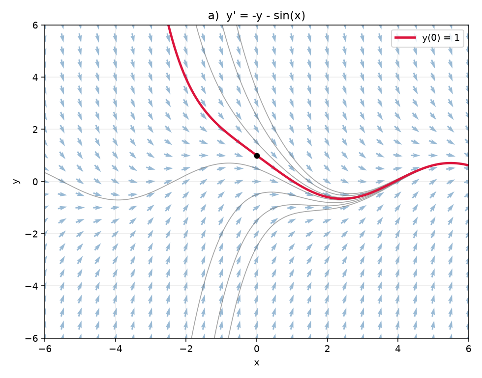

### b) y' = x + y, con y(-2) = 2

Lineal. Solución general y = C·e^x - x - 1; con y(-2) = 2 resulta C = e².

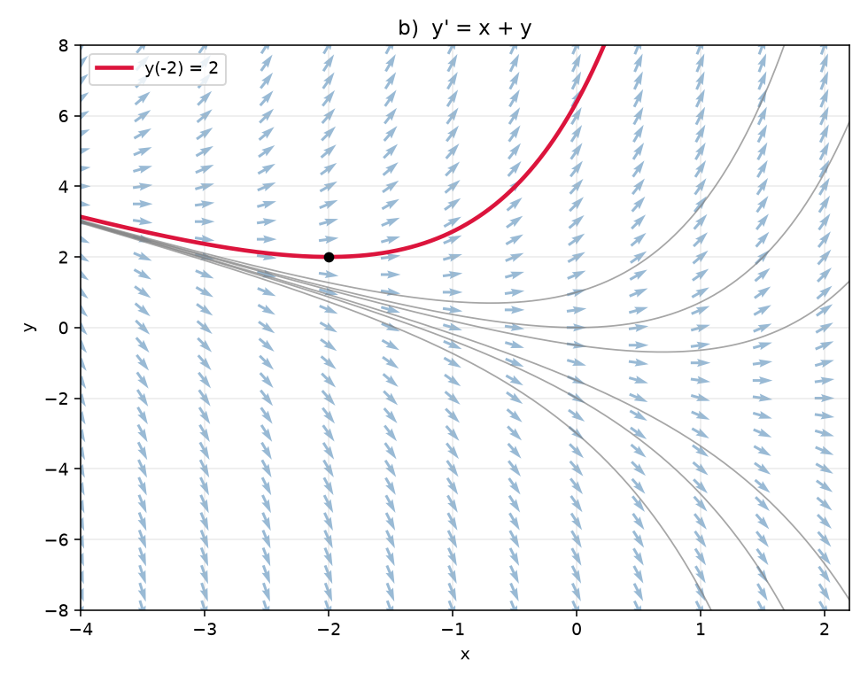

### c) y' = -x² + sin(y)  (sin condición inicial, se eligió y(0) = 0)

No tiene solución elemental en forma cerrada, así que la curva se obtuvo integrando numéricamente hacia adelante y hacia atrás en x.

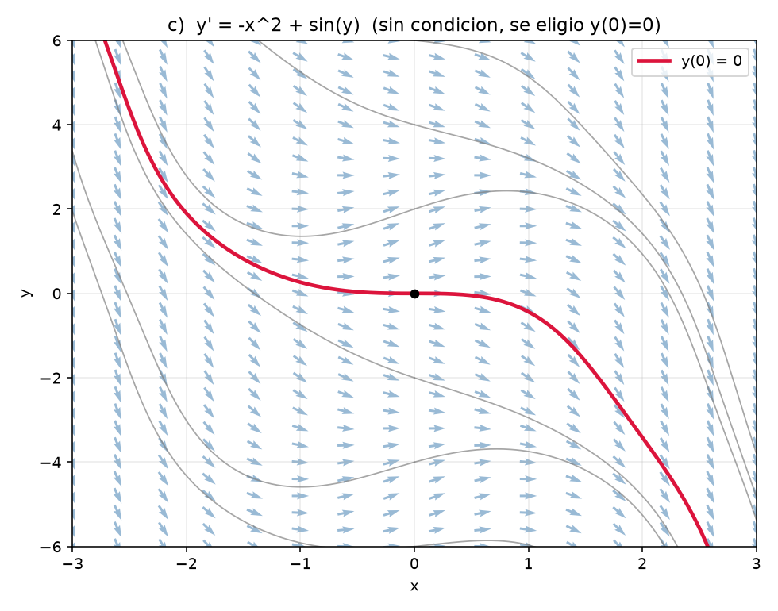

### d) (x² + 1)y' + 3xy = 6x  (sin condición inicial, se eligió y(0) = 1)

Despejando, y' = (6x - 3xy)/(x² + 1), lineal. Con factor integrante (x²+1)^(3/2) se obtiene y = 2 + C·(x²+1)^(-3/2); con y(0)=1 resulta C = -1.

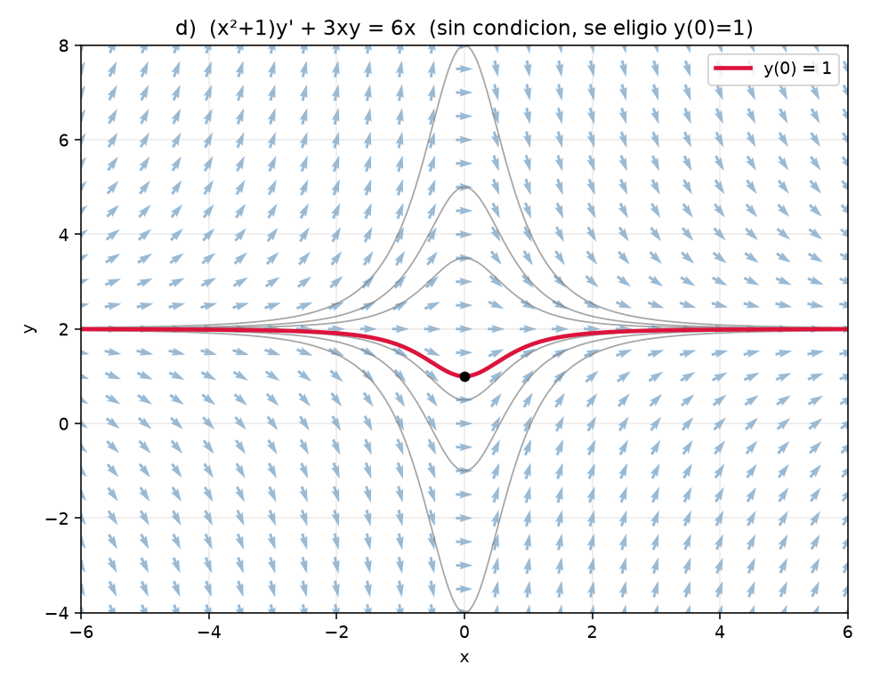

### e) y' = x·e^y  (sin condición inicial, se eligió y(0) = 0)

Separable: e^(-y) dy = x dx → y = -ln(K - x²/2). Con y(0)=0 resulta K = 1, y la solución solo existe para |x| < √2 (asíntota vertical, se ve en la gráfica).

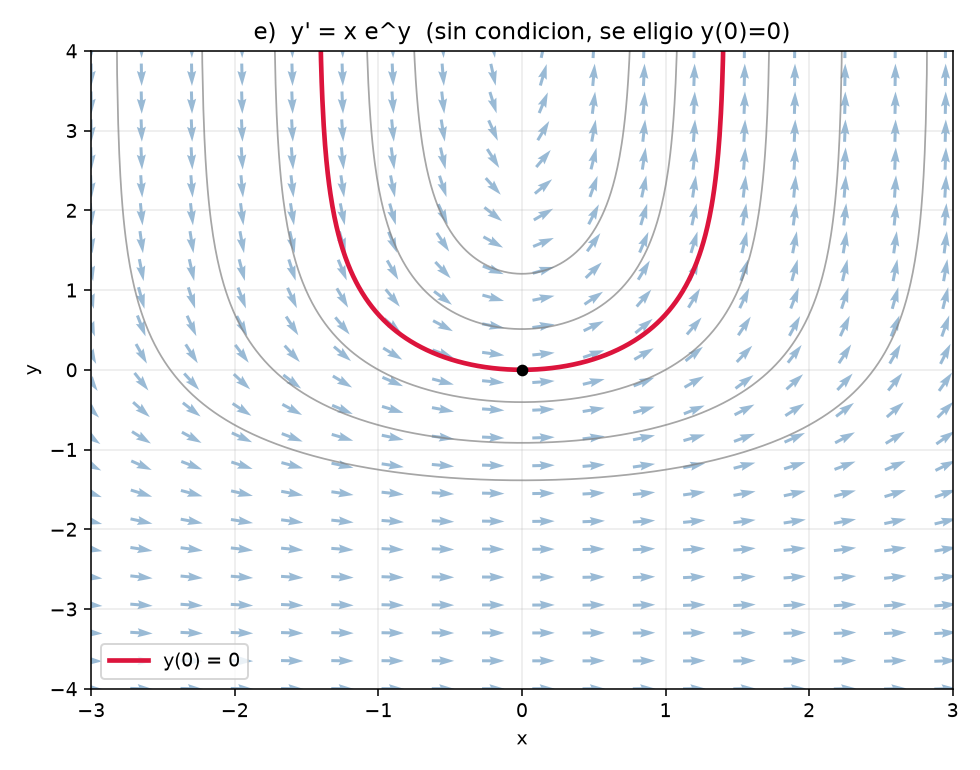

### f) y' = x - y, con y(1) = 1

Lineal. Solución general y = (x - 1) + C·e^(-x); con y(1) = 1 resulta C = e.

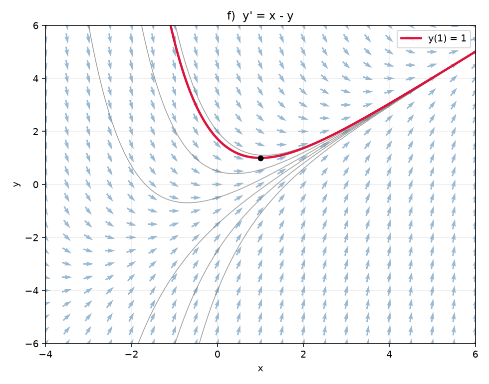

---

## Punto 2 — Diagrama de fase y puntos críticos

Script: [`punto_2/punto_2.py`](punto_2/punto_2.py)

Para cada ecuación autónoma y' = g(y) el script factoriza y halla las raíces reales de g con sympy, evalúa el signo de g justo a la izquierda y a la derecha de cada raíz para clasificarla, y grafica g(y) contra y (regiones de crecimiento en verde, decrecimiento en rojo) junto con la recta de fase.

### a) y' = y(3 - y)(y - 2)

Puntos críticos: y = 0 (**estable**), y = 2 (**inestable**), y = 3 (**estable**).

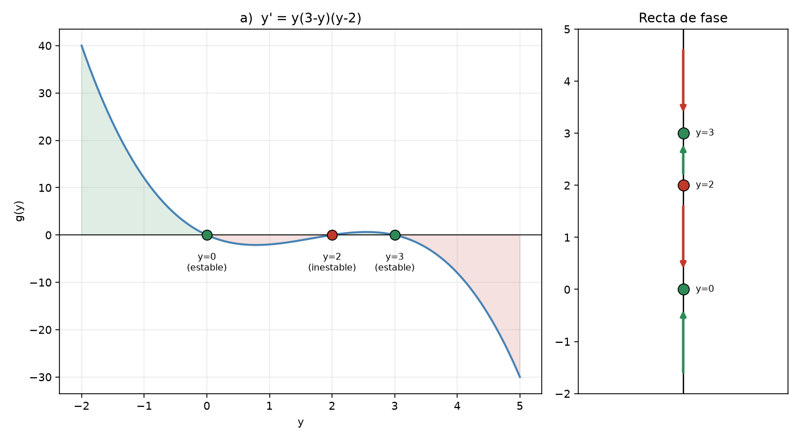

### b) y' = y² - y³

Puntos críticos: y = 0 (**semiestable**, crece a ambos lados), y = 1 (**estable**).

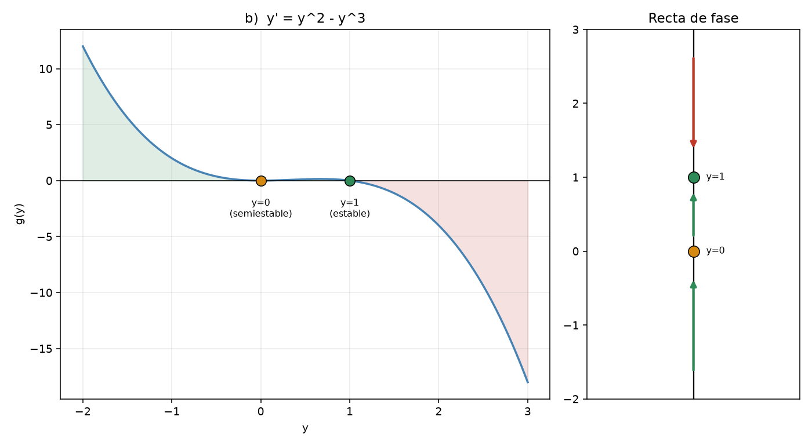

### c) y' = (y + 2)(10 + 3y - y²)

Factorizando, 10 + 3y - y² = -(y-5)(y+2), así que g(y) = -(y+2)²(y-5). Puntos críticos: y = -2 (**semiestable**), y = 5 (**estable**).

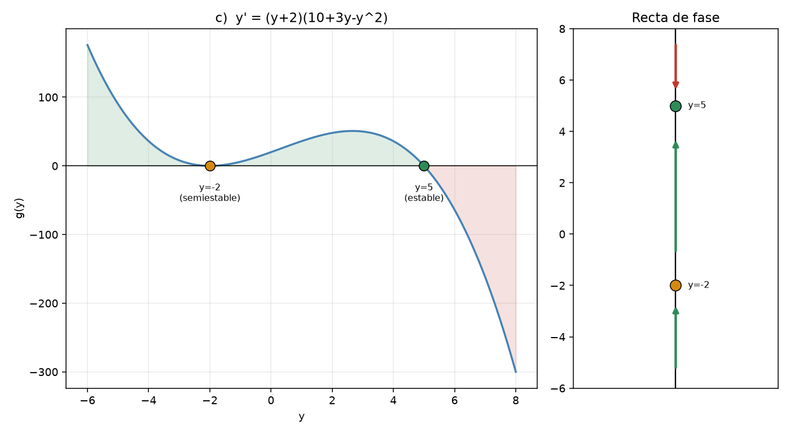

### d) y' = y⁵ - 4y³ - 5y²

g(y) = y²(y³ - 4y - 5). El factor cúbico solo tiene una raíz real (las otras dos son complejas), y ≈ 2.4567. Puntos críticos: y = 0 (**semiestable**, decrece a ambos lados), y ≈ 2.4567 (**inestable**).

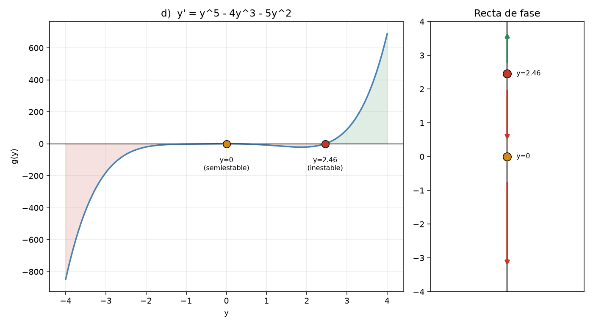

### e) y' = (1 - y)(y - 2)³

Puntos críticos: y = 1 (**inestable**), y = 2 (**estable**).

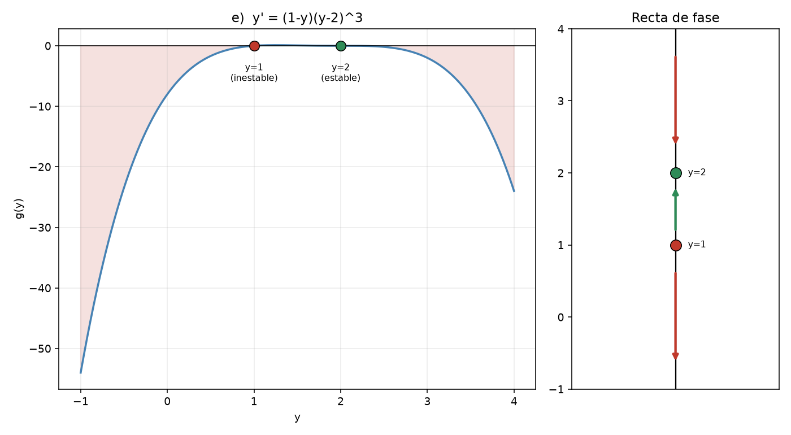

---

## Punto 3 — Población P(t), dP/dt = P(P-1)(2-P), P en miles

Script: [`punto_3/punto_3.py`](punto_3/punto_3.py)

### a) Diagrama de fase

Puntos críticos: P = 0 (**estable**), P = 1 (**inestable**), P = 2 (**estable**).

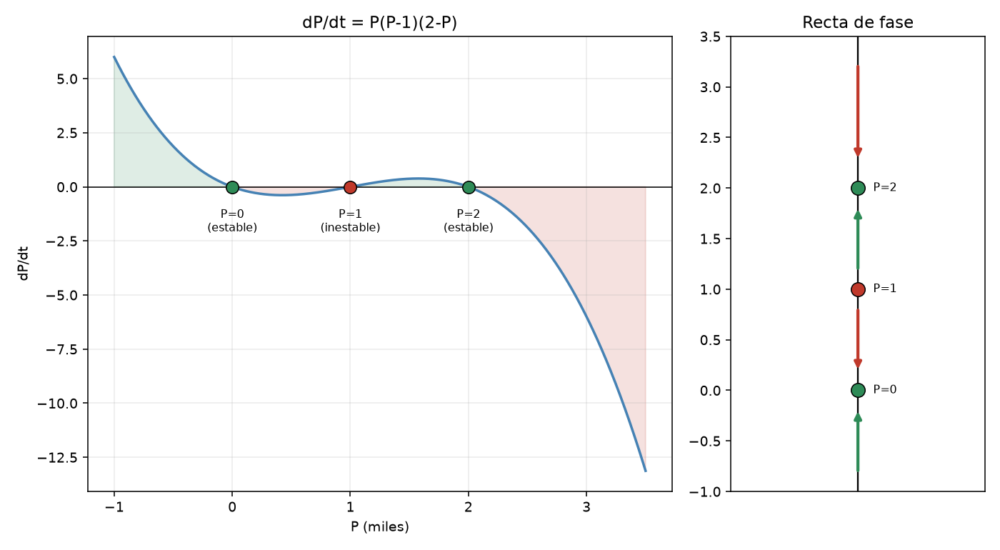

### b), c), d) y e) — trayectorias P(t)

Integrando numéricamente dP/dt = P(P-1)(2-P) para cada condición inicial se confirma exactamente lo que predice el diagrama de fase:

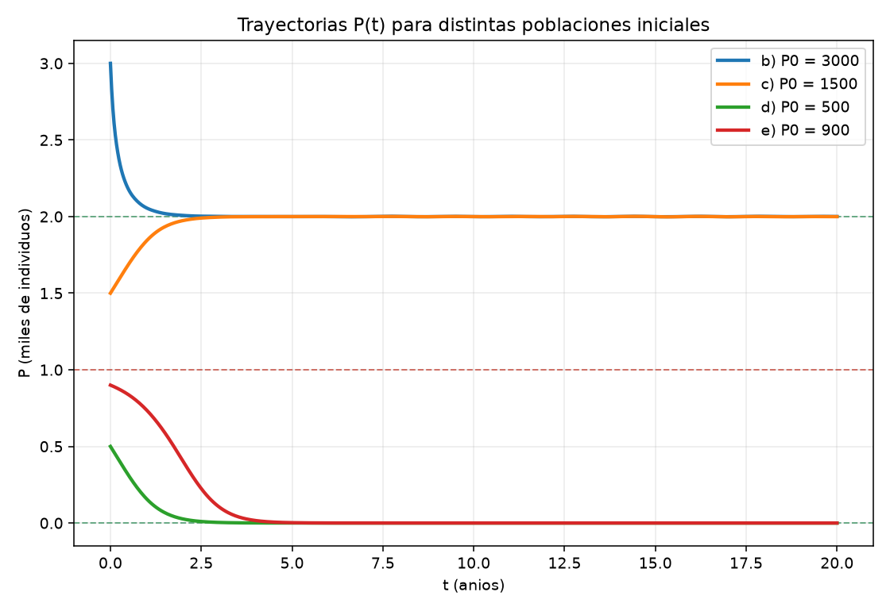

- **b) P₀ = 3000:** cae desde la región P > 2 (decreciente) hasta estabilizarse en **2000 ejemplares**.
- **c) P₀ = 1500:** está en (1,2) (creciente), sube hasta estabilizarse también en **2000 ejemplares**.
- **d) P₀ = 500:** está en (0,1) (decreciente), la población **se extingue** (P → 0).
- **e) P₀ = 900:** también está en (0,1) (decreciente). Como 900 < 1000 no puede cruzar el punto crítico inestable P=1, así que **no** puede llegar a 1100 ejemplares; por el contrario, tiende a extinguirse.

---

## Punto 4 — Población P(t), dP/dt = 3P - 2P², P en miles

Script: [`punto_4/punto_4.py`](punto_4/punto_4.py)

g(P) = P(3 - 2P)

### a) Diagrama de fase

Puntos críticos: P = 0 (**inestable**), P = 1.5 (**asintóticamente estable**, capacidad de carga del modelo logístico).

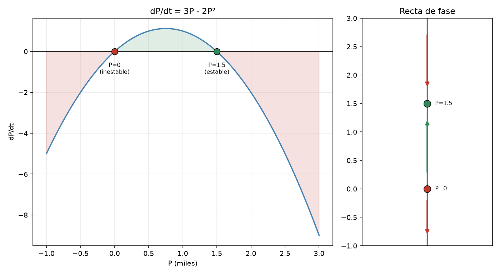

### b), c) y d) — trayectorias P(t)

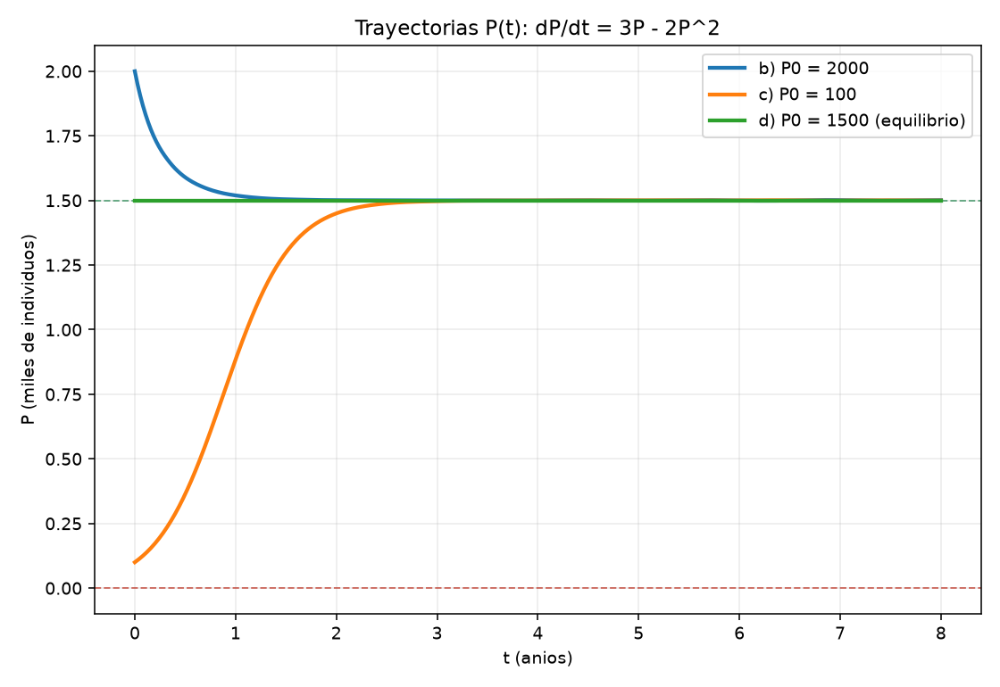

- **b) P₀ = 2000:** está por encima de la capacidad de carga (P>1.5, decreciente), baja hasta estabilizarse en **1500 ejemplares**.
- **c) P₀ = 100:** está en (0, 1.5) (creciente), sube hasta estabilizarse también en **1500 ejemplares**.
- **d) P₀ = 1500:** ya es exactamente el equilibrio P=1.5, así que la población **se mantiene constante en el tiempo**; es además el valor al que tienden todas las demás soluciones con P₀ > 0.

### e) Ecuación con nacimientos del 150% por trimestre y muertes s por trimestre

En la ecuación original, 3P son nacimientos proporcionales a la población y 2P² son muertes densidad-dependientes (competencia), ambos en tasa anual. Interpreté "tasa de nacimientos del 150% por trimestre" como que cada individuo genera en promedio 1.5 individuos nuevos por trimestre, y "mueren s ejemplares en ese periodo" como una muerte densidad-dependiente s·P² por trimestre (mismo tipo de término del modelo original, pero con tasa s en vez de 2, ya que el enunciado no da su valor numérico). Anualizando (4 trimestres al año):

dP/dt = 4(1.5P) - 4(sP²) = **6P - 4sP²**

### f) Comportamiento de las soluciones con esa tasa de muertes por trimestre

Con sympy, resolviendo 6P - 4sP² = 0 los puntos críticos simbólicos son P = 0 y P = 3/(2s). El comportamiento cualitativo es igual al del modelo logístico original: P = 0 es **inestable** y P = 3/(2s) es **asintóticamente estable**, sin importar la población inicial (mientras sea positiva). A la derecha, el diagrama de fase ilustrado con s = 2 (P = 0 inestable, P = 0.75 estable) y cómo cae la capacidad de carga 3/(2s) a medida que aumenta la tasa de muertes s:

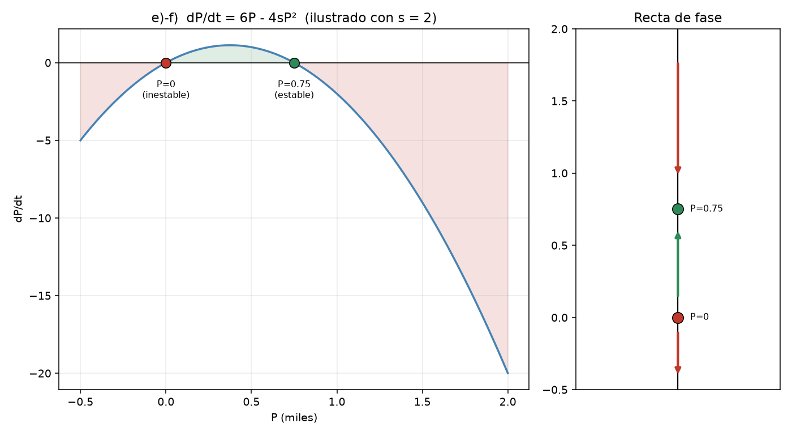
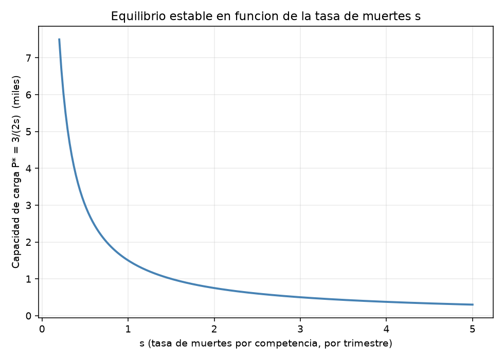

Entre más alta la tasa de muertes por competencia s, más baja la capacidad de carga a la que se estabiliza la población.
